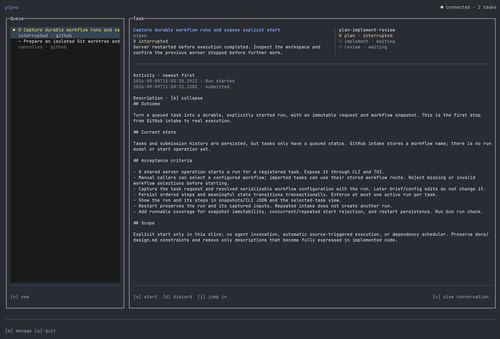

# pipes

```text
╭───┬───╮  ╭┬─────┬╮  ╭───┬───╮  ╭───┬───╮  ╭───┬───╮
│ ╭─┴─╮ │  ╰┴─╮ ╭─┴╯  │ ╭─┴─╮ │  │ ╭─┴───╯  │ ╭─┴───╯
│ │   │ │     │ │     │ │   │ │  │ ╰─┬──╮   │ ╰─┬───╮
│ ╰─┬─╯ │     ├─┤     │ ╰─┬─╯ │  │ ╭─┴──╯   ╰───┴─╮ │
│ ╭─┴───╯     │ │     │ ╭─┴───╯  ├─┤              ├─┤
├─┤        ╭┬─╯ ╰─┬╮  ├─┤        │ ╰─┬───╮  ╭───┬─╯ │
╰─╯        ╰┴─────┴╯  ╰─╯        ╰───┴───╯  ╰───┴───╯
```

A terminal-based personal software factory built to protect your attention.



---

Each source of software work follows its own process and definition of done. pipes lets you codify them and forward the boring parts to the agents, without you babysitting them.

You start by defining a TypeScript workflow (pipe):

```ts
import { pipe } from "pipes";

export default pipe({
  workflows: {
    'plan-implement-review': {
      steps: [
        {
          name: 'plan',
          agent: {
            model: 'gpt-5.6-sol',
            provider: 'codex',
            reasoning: 'high',
          },
          prompt:
            'Read the task and repository. Write an actionable implementation plan, including checks and open questions.',
        },
        ...
      ],
    },
  },
});
```

Then, you attach it to your source of intake (GitHub, Linear, Sentry, etc.):

```ts
import { pipe } from "pipes";

export default pipe({
  github: {
    assigned_to_me: true,
    repository: 'peelar/pipes',
    state: 'open',
    workflow: 'plan-implement-review',
  },
  ...
});
```

and run `pipes` to start the server + TUI.

After initial configuration, pipes pulls tasks from your configured sources and moves each through its assigned
sequence of pipes. Each pipe runs a detached agent to carry out its step.

You can monitor the work through TUI, jump into an agent session when you want to take the wheel, or use MCP to ask for tasks that require your attention.

## Features

- A keyboard-first terminal UI with live agent messages, tool activity, and step progress.
- Work that keeps running in the background, with tasks and history saved locally in SQLite.
- TypeScript workflows with model, reasoning, and prompt settings for each step.
- Separate Git worktrees for each run, with results saved to local branches.
- Run a detached agent session or jump into a task's agent session when you want to take the wheel.
- Work intake from connected tools: GitHub today, with more sources such as Linear and Sentry planned.
- MCP access for delegating work from your coding agent.
- Planned: human review and follow-up runs before accepting finished work.

> [!NOTE]
> Currently, pipes only supports Codex as the agent and GitHub as the work intake source.

## Run

Install the single binary:

```sh
curl -fsSL https://raw.githubusercontent.com/peelar/pipes/main/scripts/install.sh | sh
pipes
```
